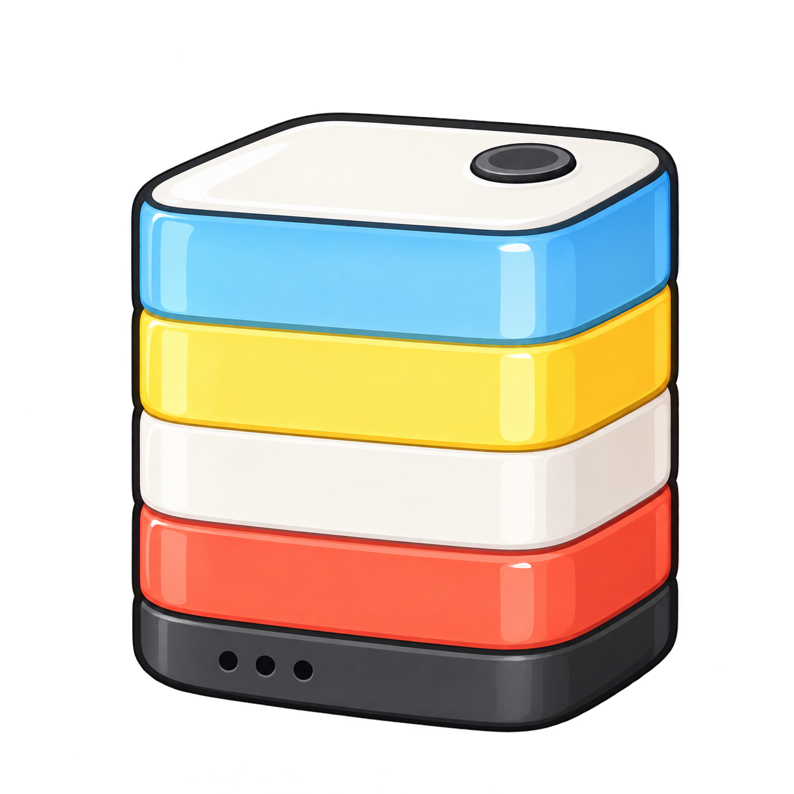
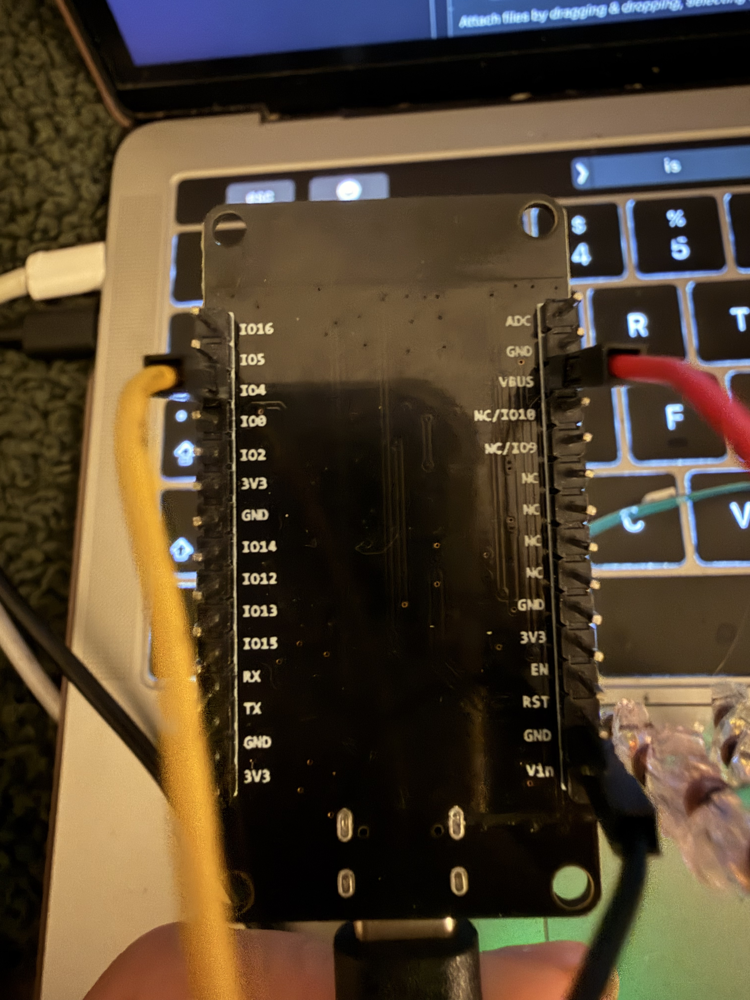
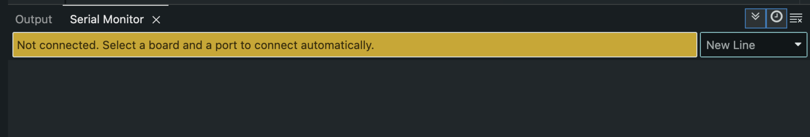
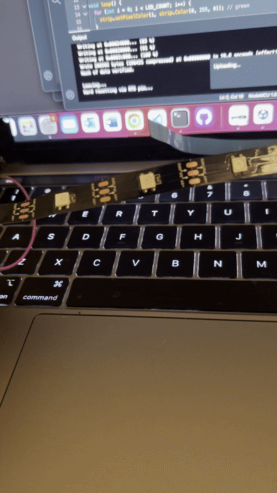
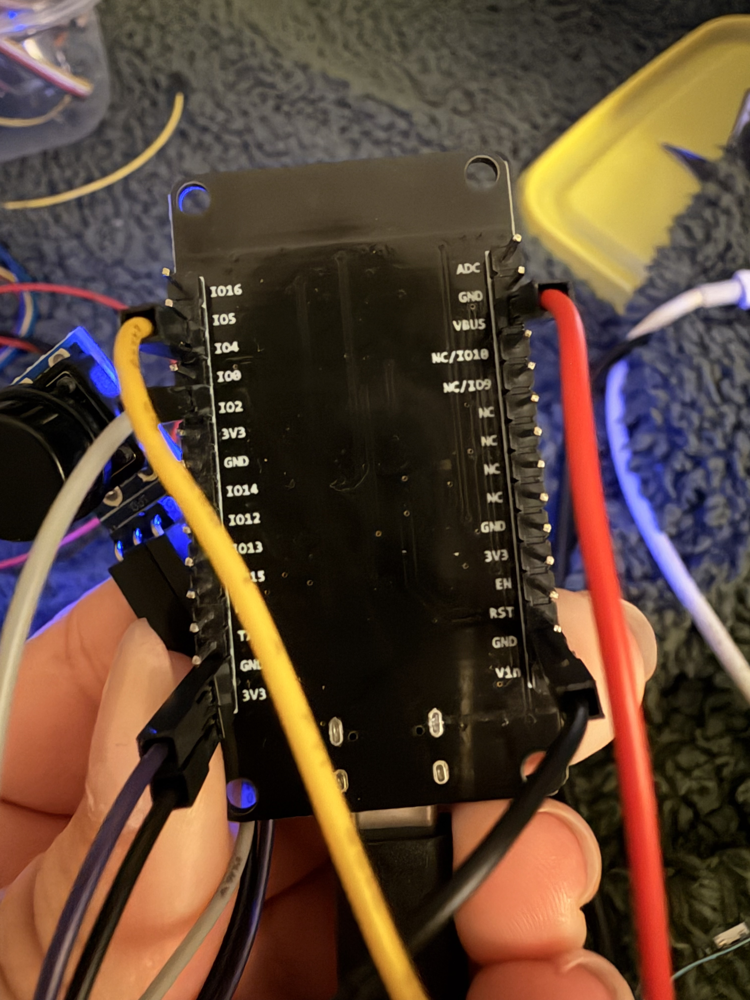
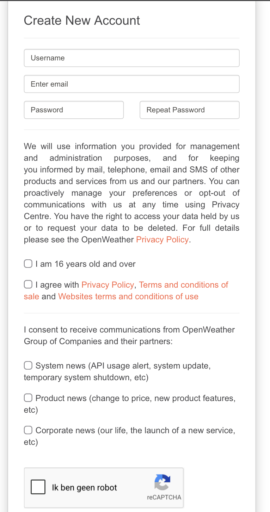
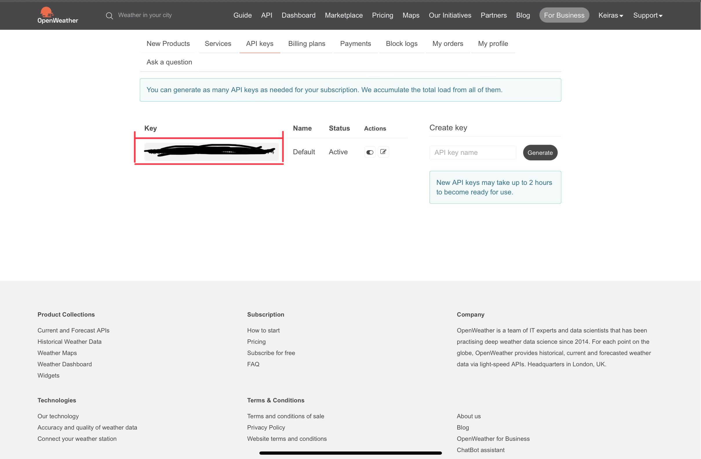
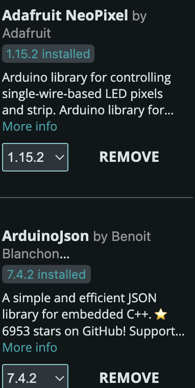
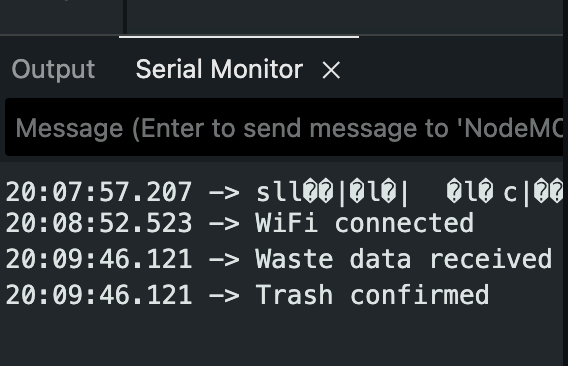

# smart-leave


## Introduction

Smart Leave is an IoT weather reminder that helps users prepare for the weather before leaving home. The system retrieves current weather data from the OpenWeather API and translates this information into a simple physical reminder.

When rain is expected, the device lights up blue. This gives the user a quick reminder to take an umbrella without having to check a weather app. After seeing the reminder, the user can press the physical button to confirm it. The light then turns off.

The prototype focuses on the main interaction of Smart Leave: retrieving weather data, translating this data into a physical light signal and allowing the user to respond using the button.

### The manual is divided into 5 steps

1. Connecting the LED strip and button
2. Setting up the OpenWeather API
3. Installing the required libraries
4. Writing and configuring the code
5. Uploading and testing the prototype

## Prerequisites

When following this manual I assume that you have the following hardware & software installed. If this is not the case, please set up your Microcontroller correctly before following this manual.

### Hardware
- NodeMCU ESP8266 Microcontroller (or similar board)
- Led strip
- Push button
- Jumpers

### Software
- Arduino IDE
- Wi-Fi credentials
- API access key 


### Required Libraries

Install these libraries using Arduino IDE, Library Manager:
- ArduinoJson
- Adafruit NeoPixel

The following libraries are included by default for ESP8266 boards:
- ESP8266WiFi.h
- ESP8266HTTPClient.h

## Step 1 – Hardware setup

### 1.1: Connect ledstrip
Connect the LED strip as follows:

- 5V of the LED strip (red) - VV (vbus) 
- GND of the LED strip (black) - GND 
- D of the LED strip (yellow) - D2



### Testing (LED strip)
Before doing anything with Wi-Fi or the API, I recommend testing if your LED strip works. <br>
First connect your board <br>
In Arduino IDE select:<br>
Tools - Board - NodeMCU 1.0 (ESP-12E Module)<br>
Tools - Port - (select the correct port)<br>

If you dont select it you get an error message: <br>


Upload this quick test sketch:

```ruby
#include <Adafruit_NeoPixel.h>

#define LED_PIN D2
#define LED_COUNT 8

Adafruit_NeoPixel strip(LED_COUNT, LED_PIN, NEO_GRB + NEO_KHZ800);

void setup() {
  strip.begin();
  strip.show();
}

void loop() {
  for (int i = 0; i < LED_COUNT; i++) {
    strip.setPixelColor(i, strip.Color(0, 255, 0)); // green
  }
  strip.show();
  delay(2000);

  strip.clear();
  strip.show();
  delay(2000);
}
```



#### Common mistakes
- Forgetting to connect GND - LEDs will not work  
- Using the wrong data pin - LED stays off  
- Powering the LED strip incorrectly
- Wrong LED_COUNT - only part of the strip lights up

### 1.2  Button
Connect the button as follows with jumper wires:

- vcc - 3v3
- GND - GND 
- OUT - D7



### Testing (button)
Upload this code:
```ruby
#include <Adafruit_NeoPixel.h>

#define LED_PIN     4    
#define LED_COUNT   30
#define BUTTON_PIN  13    

Adafruit_NeoPixel strip(LED_COUNT, LED_PIN, NEO_GRB + NEO_KHZ800);

bool ledOn = true;           
bool lastButton = HIGH;
unsigned long lastTime = 0;
const unsigned long debounce = 50;

void setStrip(bool on) {
  if (on) {
    for (int i = 0; i < LED_COUNT; i++) {
      strip.setPixelColor(i, strip.Color(0, 255, 0));
    }
  } else {
    strip.clear();
  }
  strip.show();
}

void setup() {
  pinMode(BUTTON_PIN, INPUT_PULLUP);

  strip.begin();
  strip.setBrightness(100);

  setStrip(true);           
}

void loop() {
  bool reading = digitalRead(BUTTON_PIN);

  if (reading != lastButton) {
    lastTime = millis();
    lastButton = reading;
  }

  if ((millis() - lastTime) > debounce) {
    if (reading == LOW && lastButton == LOW) {
      // knop is stabiel ingedrukt
      ledOn = !ledOn;
      setStrip(ledOn);

      // wachten tot knop losgelaten is
      while (digitalRead(BUTTON_PIN) == LOW) {
        delay(10);
      }
    }
  }
}

```
If you push the button the led should go on and off.


#### Common mistakes
- Connecting the button to the wrong pin  
- Button wired to 5V instead of 3V3  

## Step 2:API access

Smart leave uses the Amsterdam data API to retrieve the weather data. To access the API an API key is required.

Register a client at:
https://openweathermap.org



kopieer de volledige code.


Never commit your API key to GitHub!!!

In the code later replace with your API key:

```ruby
const char* API_KEY = "YOUR_API_KEY_HERE";
```

### Common mistakes
- Using an expired or inactive API key
- Forgetting to update the key in the code
- Expecting the API to work immediately

## Step 3: Install libraries

Open Arduino IDE and go to:
Sketch → Include Library → Manage Libraries

Install:
- ArduinoJson
- Adafruit NeoPixel

These libraries are required for:
- Reading JSON data from the API
- Controlling the LED strip



If Arduino gives an error like:
- ArduinoJson.h: No such file or directory
- Adafruit_NeoPixel.h: No such file or directory
it means the library is not installed correctly.

## Step 4: The code
And now the hard the code. This part took a long time, but in the manual I will just post the full code below. You can copy everything, just change these things:

```cpp
const char* WIFI_SSID = "YOUR_WIFI_NAME";
const char* WIFI_PASSWORD = "YOUR_WIFI_PASSWORD";
const char* API_KEY = "YOUR_OPENWEATHER_API_KEY";

const float LATITUDE = 52.3676;
const float LONGITUDE = 4.9041;
```

### What the code does

1. Connects the ESP8266 to Wi-Fi.
2. Requests OpenWeather forecast data.
3. Reads the next two 3-hour forecast blocks.
4. Checks for `Rain`, `Drizzle` or `Thunderstorm`.
5. If rain is expected, the LED strip turns blue.
6. The user presses the physical button after seeing the reminder.
7. The blue light turns off and stays acknowledged while the rain condition remains active.
8. The weather is checked again every ten minutes.
Create a new Arduino sketch and paste everything below.

```ruby
#include <ESP8266WiFi.h>
#include <WiFiClientSecure.h>
#include <ArduinoJson.h>
#include <Adafruit_NeoPixel.h>

// SETTINGS
const char* WIFI_SSID = "YOUR_WIFI_NAME";
const char* WIFI_PASSWORD = "YOUR_WIFI_PASSWORD";
const char* API_KEY = "YOUR_OPENWEATHER_API_KEY";

// Amsterdam, Change these coordinates to the location you want to use.
const float LATITUDE = 52.3676;
const float LONGITUDE = 4.9041;

#define LED_PIN D2
#define BUTTON_PIN D7
#define LED_COUNT 30
#define LED_BRIGHTNESS 80

// Ten minutes 
const unsigned long UPDATE_INTERVAL = 10UL * 60UL * 1000UL;

WiFiClientSecure client;
Adafruit_NeoPixel strip(LED_COUNT, LED_PIN, NEO_GRB + NEO_KHZ800);

bool reminderActive = false;
bool rainAcknowledged = false;
unsigned long lastWeatherCheck = 0;

void setBlueLight(bool on) {
  if (on) {
    for (int i = 0; i < LED_COUNT; i++) {
      strip.setPixelColor(i, strip.Color(0, 0, 255));
    }
  } else {
    strip.clear();
  }
  strip.show();
}

void connectWiFi() {
  WiFi.begin(WIFI_SSID, WIFI_PASSWORD);
  Serial.print("Connecting to Wi-Fi");

  while (WiFi.status() != WL_CONNECTED) {
    delay(500);
    Serial.print(".");
  }

  Serial.println("\nWi-Fi connected");
}

// source: chatGPT
// Checks the next 6 hours 
// Returns true when OpenWeather predicts Rain, Drizzle or Thunderstorm.
bool rainExpectedSoon() {
  if (WiFi.status() != WL_CONNECTED) {
    connectWiFi();
  }

  client.setInsecure(); 

  String url = "/data/2.5/forecast?lat=" + String(LATITUDE, 4) +
               "&lon=" + String(LONGITUDE, 4) +
               "&cnt=2&appid=" + String(API_KEY) + "&units=metric";

  Serial.println("Checking OpenWeather forecast...");

  if (!client.connect("api.openweathermap.org", 443)) {
    Serial.println("Connection to OpenWeather failed");
    return false;
  }

  client.print(String("GET ") + url + " HTTP/1.1\r\n" +
               "Host: api.openweathermap.org\r\n" +
               "User-Agent: SmartLeave/1.0\r\n" +
               "Connection: close\r\n\r\n");

  unsigned long timeout = millis();
  while (client.connected() && !client.available()) {
    if (millis() - timeout > 5000) {
      Serial.println("OpenWeather request timed out");
      client.stop();
      return false;
    }
    delay(10);
  }

  while (client.connected()) {
    String line = client.readStringUntil('\n');
    if (line == "\r") break;
  }

  DynamicJsonDocument doc(8192);
  DeserializationError error = deserializeJson(doc, client);
  client.stop();

  if (error) {
    Serial.print("JSON error: ");
    Serial.println(error.c_str());
    return false;
  }

  if (doc["cod"].as<String>() != "200") {
    Serial.println("OpenWeather returned an error");
    return false;
  }

  bool rainSoon = false;
  JsonArray forecasts = doc["list"].as<JsonArray>();

  for (JsonObject forecast : forecasts) {
    const char* condition = forecast["weather"][0]["main"] | "";
    Serial.print("Forecast condition: ");
    Serial.println(condition);

    if (strcmp(condition, "Rain") == 0 ||
        strcmp(condition, "Drizzle") == 0 ||
        strcmp(condition, "Thunderstorm") == 0) {
      rainSoon = true;
    }
  }

  return rainSoon;
}

void updateReminder() {
  bool rainSoon = rainExpectedSoon();

  if (rainSoon) {
    Serial.println("Rain expected in the next 6 hours.");

    if (!rainAcknowledged) {
      setBlueLight(true);
      reminderActive = true;
      Serial.println("Smart Leave reminder ON: take an umbrella.");
    }
  } else {
    Serial.println("No rain expected in the next 6 hours.");
    setBlueLight(false);
    reminderActive = false;
    rainAcknowledged = false;
  }
}

void setup() {
  Serial.begin(115200);
  pinMode(BUTTON_PIN, INPUT_PULLUP);

  strip.begin();
  strip.setBrightness(LED_BRIGHTNESS);
  setBlueLight(false);

  connectWiFi();

  // Check after startup.
  updateReminder();
  lastWeatherCheck = millis();
}

void loop() {
  // Physical confirmation: pressing the button turns the reminder off.
  if (reminderActive && digitalRead(BUTTON_PIN) == LOW) {
    delay(30); // debounce
    if (digitalRead(BUTTON_PIN) == LOW) {
      setBlueLight(false);
      reminderActive = false;
      rainAcknowledged = true;
      Serial.println("Reminder acknowledged. Blue light OFF.");

      while (digitalRead(BUTTON_PIN) == LOW) {
        delay(10);
      }
    }
  }

  if (millis() - lastWeatherCheck >= UPDATE_INTERVAL) {
    lastWeatherCheck = millis();
    updateReminder();
  }
}

```

## Step 5  – Upload & test

Connect the NodeMCU to your laptop via USB

In Arduino IDE select:
Tools - Board - NodeMCU 1.0 (ESP-12E Module)
Tools - Port - (select the correct port)

Push: CMD+U or the arrow 

Open Serial Monitor 

### Expected behavior

After connecting to Wi-Fi the Serial Monitor prints:

WiFi connected
Waste data received 
The LED strip turns green
Pressing the button turns the LED strip off



The led will only turn on if its close to put the trash outside.

If this works: the prototype works!


